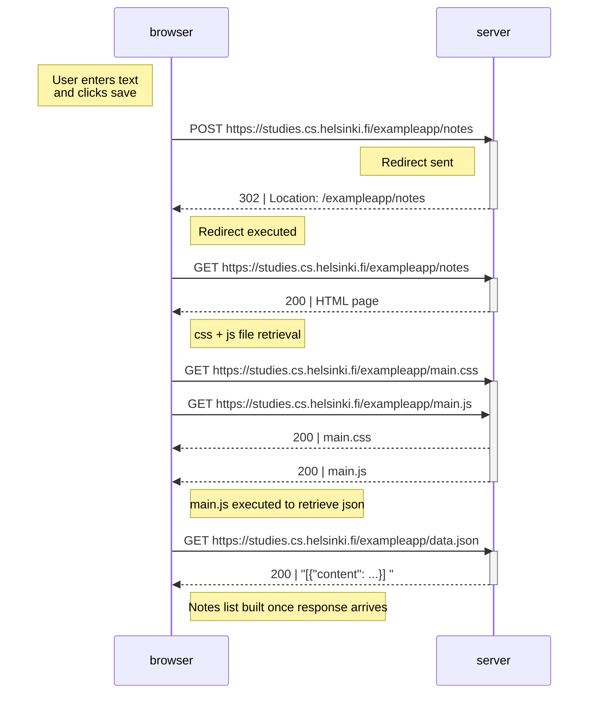

```mermaid
sequenceDiagram
    participant browser
    participant server

    Note left of browser: User enters text<br/>and clicks save
    browser->>server: POST https://studies.cs.helsinki.fi/exampleapp/notes
    activate server
    Note left of server: Redirect sent
    server-->>browser: 302 | Location: /exampleapp/notes
    deactivate server

    Note right of browser: Redirect executed
    browser->>server: GET https://studies.cs.helsinki.fi/exampleapp/notes
    activate server
    server-->>browser: 200 | HTML page
    deactivate server

    Note right of browser: css + js file retrieval
    browser->>server: GET https://studies.cs.helsinki.fi/exampleapp/main.css
    activate server
    browser->>server: GET https://studies.cs.helsinki.fi/exampleapp/main.js
    server-->>browser: 200 | main.css
    server-->>browser: 200 | main.js
    deactivate server

    Note right of browser: main.js executed to retrieve json
    browser->>server: GET https://studies.cs.helsinki.fi/exampleapp/data.json
    activate server
    server-->>browser: 200 | "[{"content": ...}] "
    deactivate server
    
    Note right of browser: Notes list built once response arrives
```
