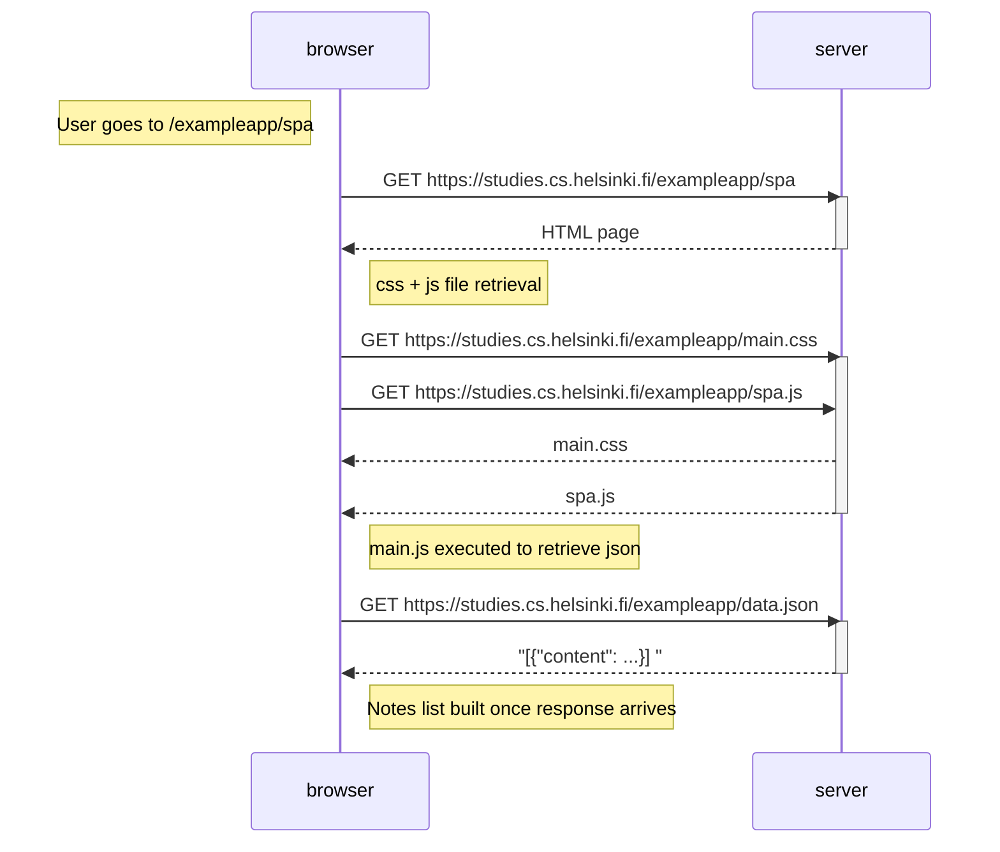

```mermaid
sequenceDiagram
    participant browser
    participant server

    Note left of browser: User goes to /exampleapp/spa
    browser->>server: GET https://studies.cs.helsinki.fi/exampleapp/spa
    activate server
    server-->>browser: HTML page
    deactivate server

    Note right of browser: css + js file retrieval
    browser->>server: GET https://studies.cs.helsinki.fi/exampleapp/main.css
    activate server
    browser->>server: GET https://studies.cs.helsinki.fi/exampleapp/spa.js
    server-->>browser: main.css
    server-->>browser: spa.js
    deactivate server

    Note right of browser: main.js executed to retrieve json
    browser->>server: GET https://studies.cs.helsinki.fi/exampleapp/data.json
    activate server
    server-->>browser: "[{"content": ...}] "
    deactivate server
    
    Note right of browser: Notes list built once response arrives
```
